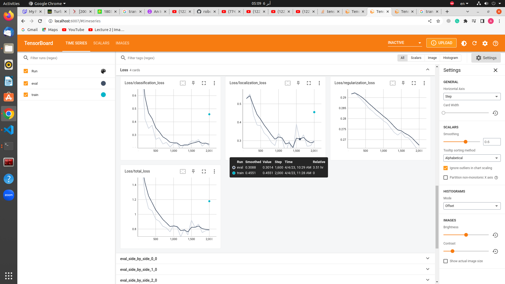
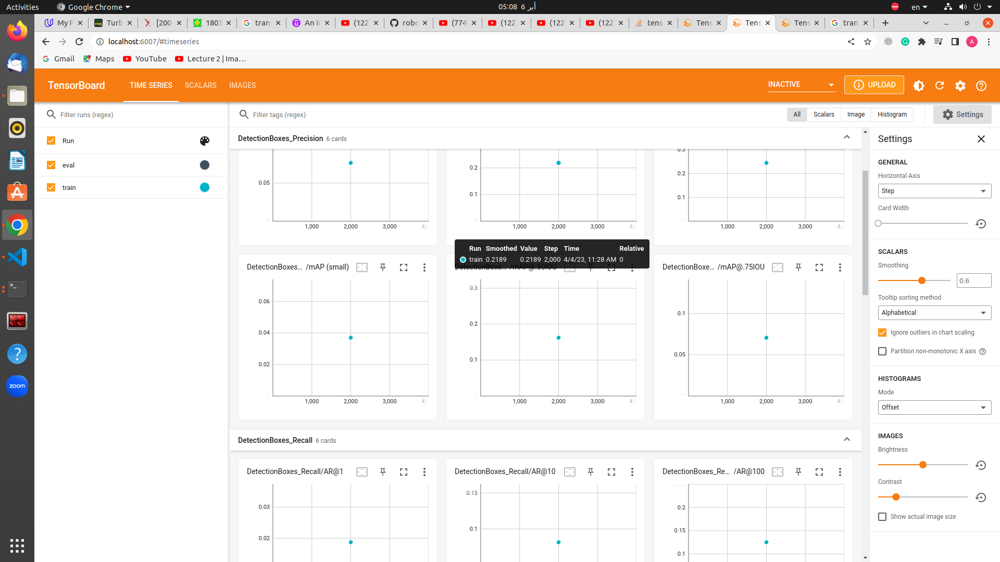
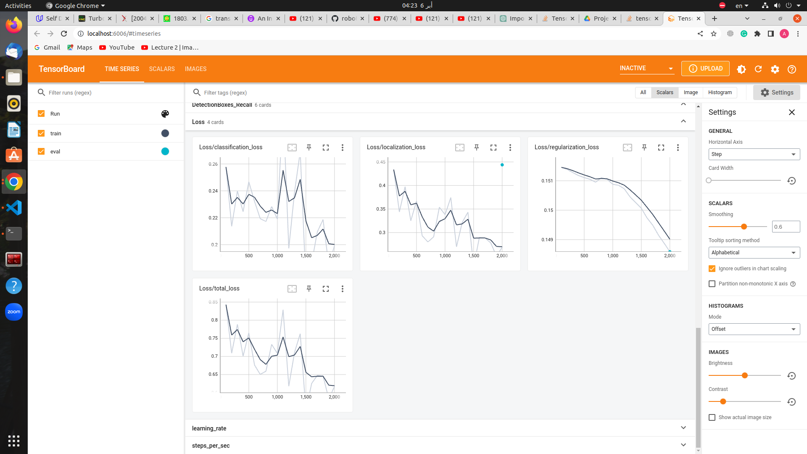
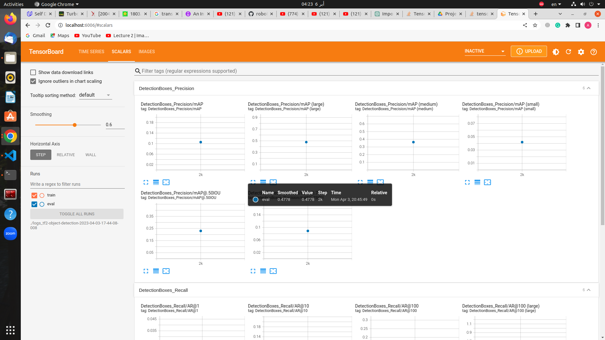
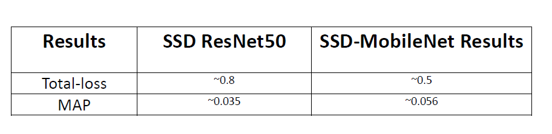

# Asem's Report

## EffecientNet Results
* **This model is good but not the best for this data because it is slower than SSD-MobileNet and has low efficient.**

## SSD ResNet50
* **Training this model took about five hours and there was a problem with detection, as it could not detect vehicles very well and could not detect humans at all.But I think the detection will be good  by changing some values in data_augmentation_options in pipeline**

## SSD-MobileNet Results
* **It took only one hour to train this model, and its accuracy was the best in relation to the measurements shown using tensorboard.**  

## Summary

* **Regarding the following table, we conclude that SSD-MobileNet is the best because it is the least total loss.** 

## Implementation problems
* **First I used this instance type 'ml.trn1.2xlarge' because the given one has many errors I can't train the model with it.**

* **The specified value is on the AWS account and is not sufficient to train this model to compare them, and the account was closed before training was completed due to the consumption of $25.**

* **Some lessons should have been provided on how to use the AWS platform.**